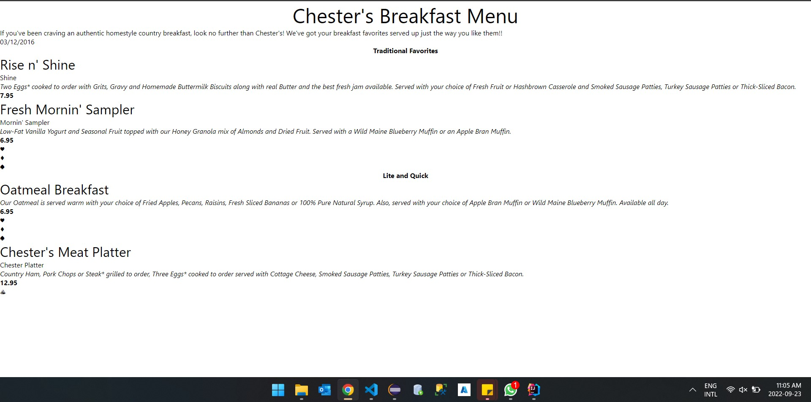

# Module 2 - Assignment
# 1. ERRORS
- Line 11: The element name 'effectiveDate' was seperated by a space. It should be a single word or compound word seperated by some characters like '_', '-', or by capitalization of the first letter of the subsequent words in the phrase.

Correction: Removed the space between 'effective' and 'Date'

- Line 31: Closing tag 'originalname' is different from it's opening tag due to typo.

Correction: Changed closing tag to 'originalName' from originalname'

- Line 51: Unmatched tags

Correction: Changed opening tag to 'originalName' as there is not other tag named 'name'

# 2. Use of CDATA
CDATA is used in place of character entities and references to allow for special characters to be used without conflict. The data within the block is seen as a string and cannot be parsed. This helps the string keep its format as it was originally enter in the CDATA block

# 3. End of file comment

# 4. Components of the document

The document does not have any processing instructions. It only has the XML declaration

# 5. Inline DTD

# 6. Validation

# 7. Stylesheet

