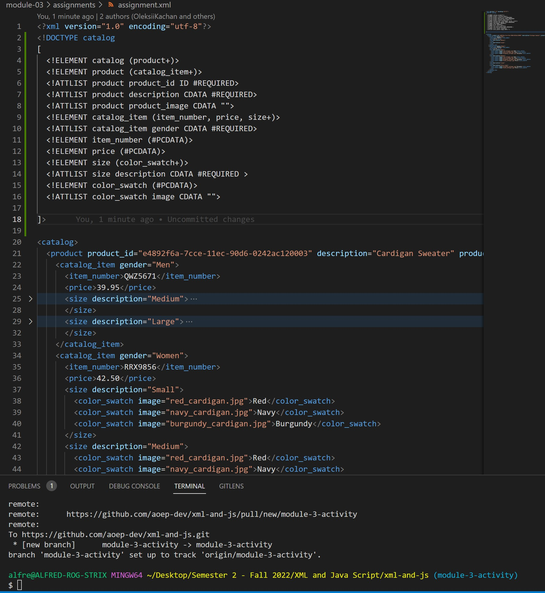
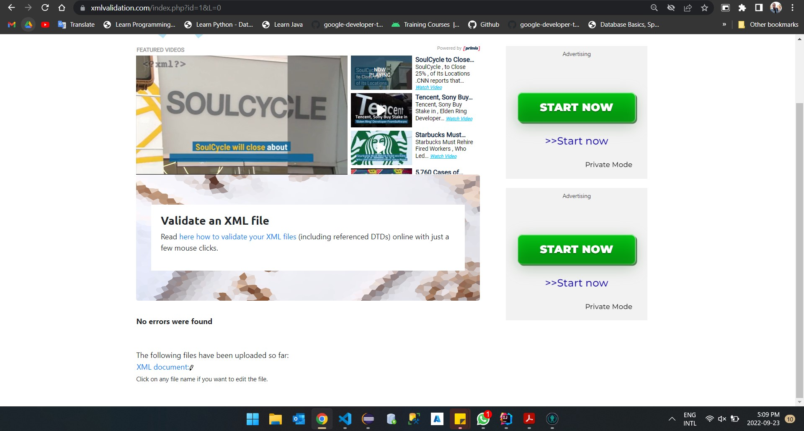
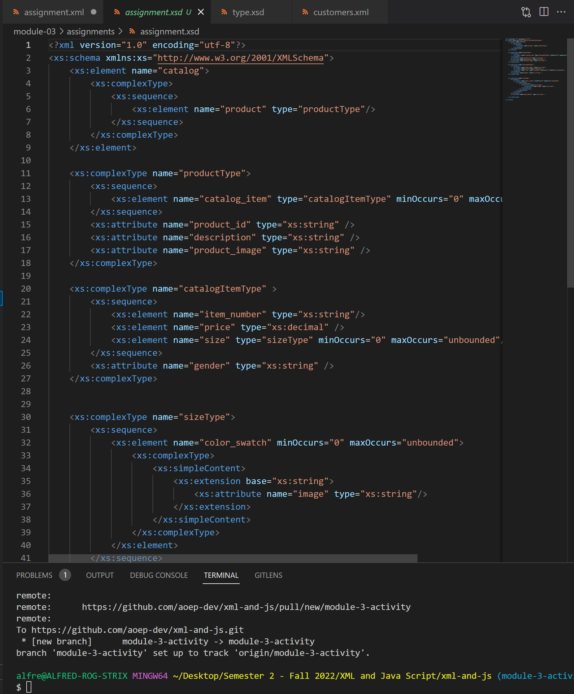
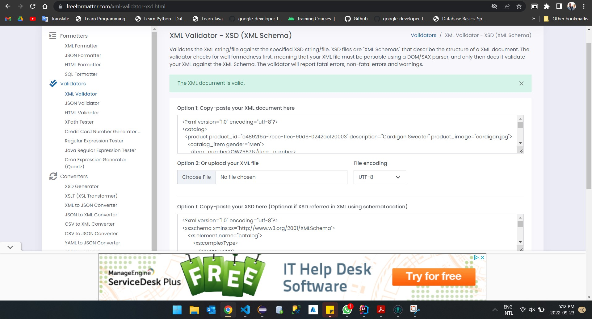

# Module 3 Assignment

## 2. XML & DTD Validation

## 3. XML & XSD Validation

## 4. Conclusion
After working with both DTD and XSD, one realizes that there is a lot of advantages of XSD over DTD. Some are listed below:
1. XSD follows similar formats/structure of XML and leads to less confusion when working with it.
2. From the perspective of a different observer, the XSD declaration format is much easier to decipher at a glance.
3. XSD being created in an external file, can be reused on multiple documents by simply linking it.
