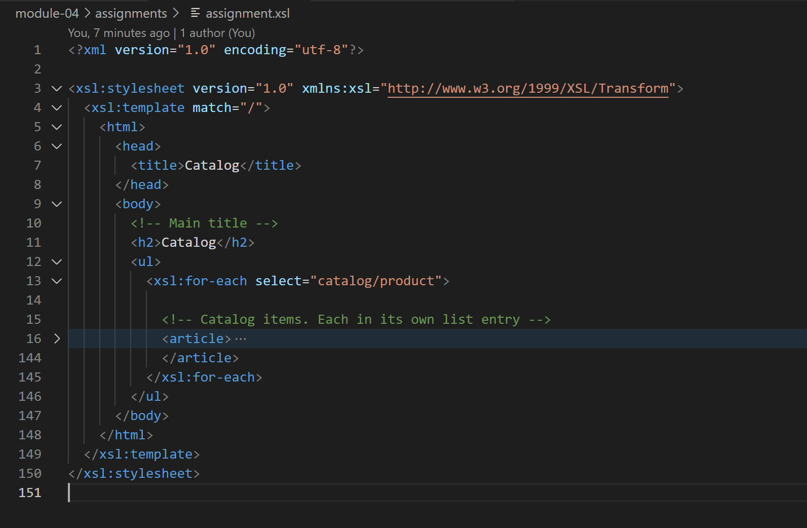
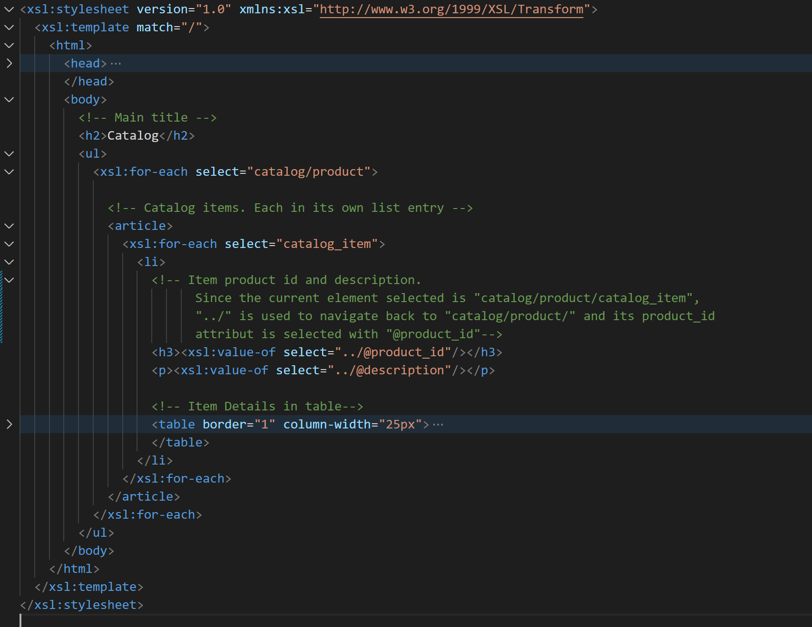
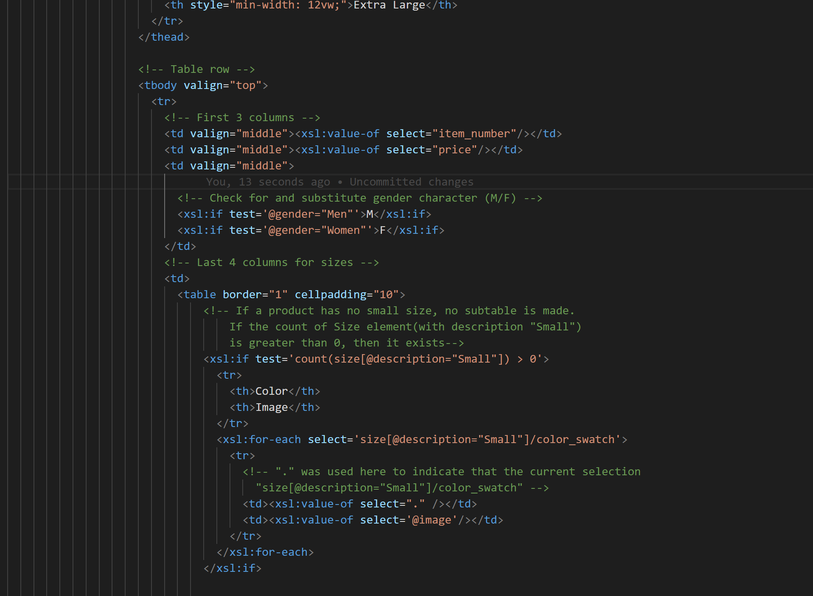
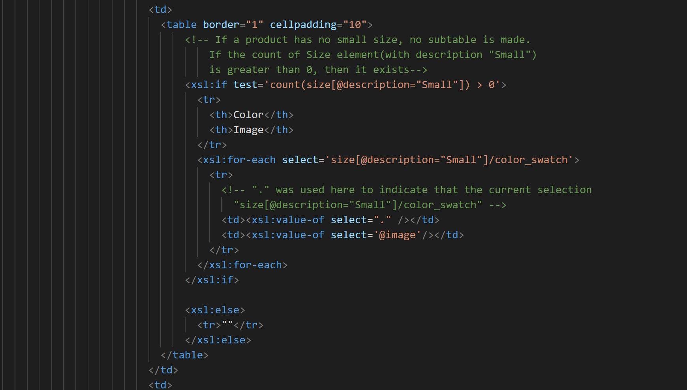
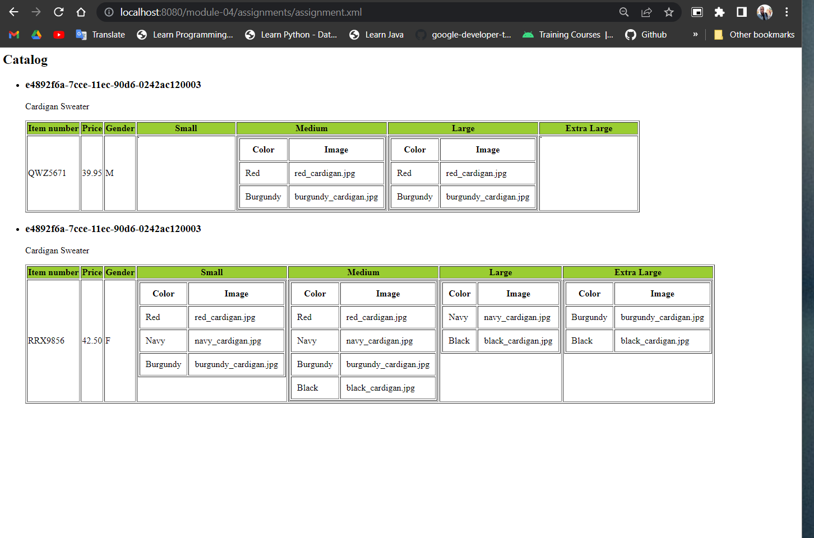

# Module 04 Assignment

Although there may be better formats to data storage, XML is a handy way to store data with custom tags. XSL gives the ability to format and display this data in various ways. As such, XSL appears to be a very important tool whwen working with XML.

XSL is actually quite simple. The difficulty can come in using the XPATH query which is used to select the particular XML element/element content for display. Mastering XPATH queries, makes XSL very simple to work with. An example of what can get confusing is, understanding the current selected element and navigating from there to its child elements, or using "../" to select it's parent element.

1. Main title and catalog item in article in html list tag.

2. Product id in h3 tag and product description in paragraph tag.

3. All columns item number, price, gender, small, medium, large, extra large.

4. Sub-table for color and image. 

5. Final XSL transformation
