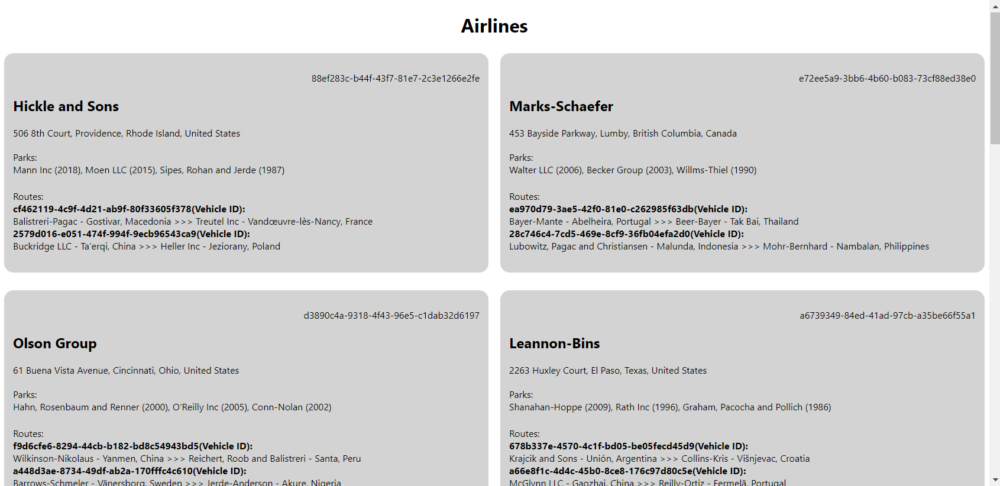

# Project 1 - GROUP 09
## Topic: Airlines

### Introduction

This project was split into 3 tasks - XML file/XSLT, DTD/XSD, and HTML/JS

My responsibility was working the HTML file. This entails creating the HTML file and loading the XML data dynamically.

The main hurdle in achieving this, is understanding that each xml's getElementsByTagName returns an array of ALL the elements of the selected name within the selected xml node. Once you can address the arrays element properly, there should be no obstacles.

### Structure
In the JS script, each of the xml carrier element is stored in a div with a carrier id tag for css style targeting
The carrier information are stored in h2 or p tags, some with class tags for css targeting

The document is styled with css grid of 2 columns. Columns have a grid gap of 20px. Other styling were applied on the elements and tags that will be created dynamically.

### Conclusion
XML is a great tool for storing data. It may have it's strengths, but working with JSON in JS seems to be the better choice. This is because JSON stores data n format that is like JS objects. 

HTML Page after data is loaded