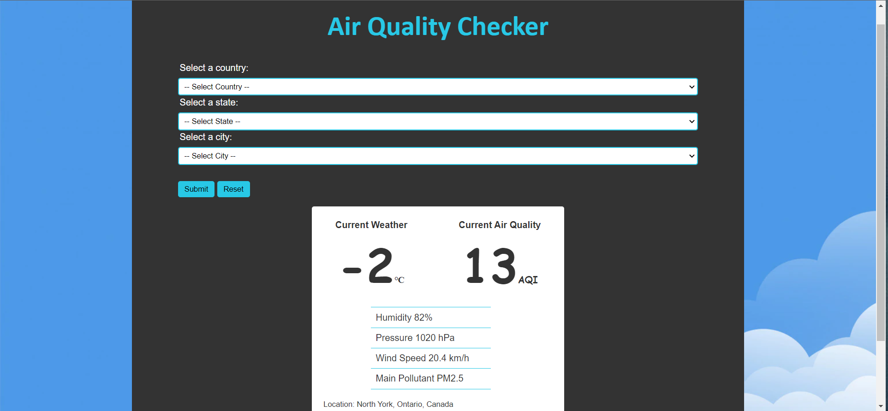
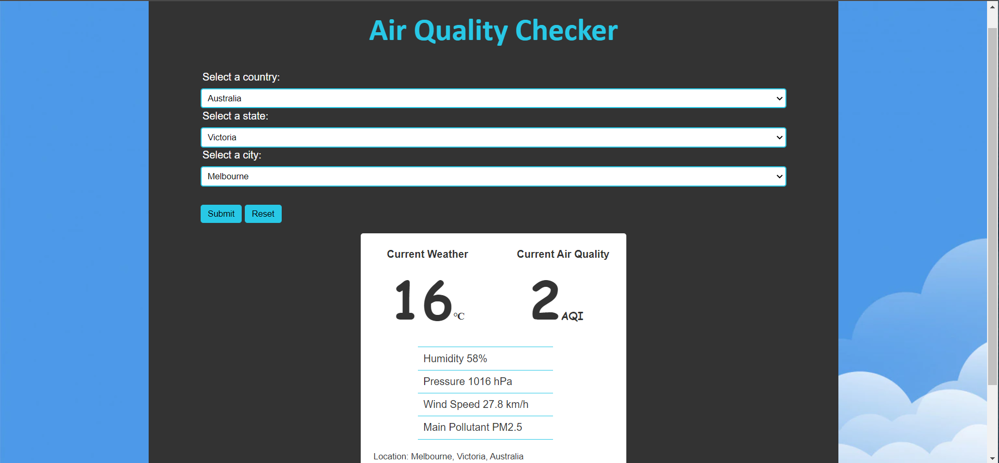

# Project 2 - GROUP 09
## Topic: Air Quality Checker

## Introduction
This project deals with getting weather and pollution data form the 3rd Party API and dynamically loading it into the HTML page.

## Structure
The project was split into 3 parts,
- connecting to the API and getting all the needed data into a variable for use, as well as making other Javascript logic,
- using working with the HTML file and the sourced data to structure the HTML (rendering), and
- styling the HTML with CSS

My responsibility was the first; connecting to the API and sourcing the data.
The following data were sourced with API methods that were documented for each by the provider:
- Data from on current location based on IP geo-location
- List of supported countries
- List of supported states
- List of supported cities
- Data for a location based on city, state and country parameters

On page load, the current location's weather data is sourced and passed to be rendered. Before rendering, there is a check to see if the HTML form is complete. If it is, the working data is updated with that for the form's location, and it is ready to be rendered. 

The form is populated dynamically, with the list of countries. This is sourced and populated on page load. An event listener is triggered when a country is selected, then the function for sourcing the list of state (based on the selected country) is called and populated in the form. Another event listener is triggered in state select. On triggering the list of city is sourced and used to populate the list. A final event listener is triggered when the city is selected in the form. This sets a global variable to true, indicating that the form is filled. At this point, when the form is submitted and the data is called to re-render, the data for the forms location will be soured and rendered, instead of the IP location weather data.

## Conclusion
With the way the data is sourced, API calls are limited, and this goes a long way to save resources, and in this case, overcome limitations due to limit in calls per minute/month.

HTML Page after initial load or reset.

HTML Page after completing and submitting the form.